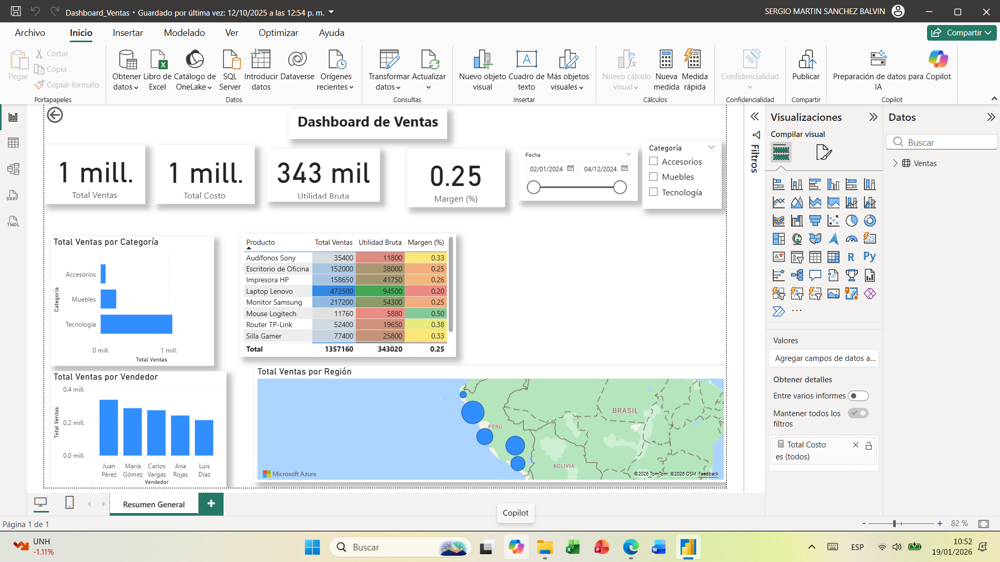

# Dashboard de Ventas (Power BI)

**Dashboard interactivo de ventas diseñado para visualizar KPIs y apoyar la toma de decisiones en la empresa.**

---

## Resumen del Proyecto

Este proyecto consiste en un dashboard en Power BI que permite analizar el desempeño de ventas por producto, vendedor y región.  
El dashboard proporciona métricas clave y visualizaciones interactivas para identificar tendencias, oportunidades y áreas de mejora.

---

## Impacto en el Negocio / Resultados Clave

- Visualización clara de **ventas totales y por categoría de producto**.  
- Ranking de los **mejores vendedores y zonas con mayor desempeño**.  
- Seguimiento de tendencias mensuales y comparaciones año a año.  
- Facilita la toma de decisiones basada en datos mediante KPIs interactivos.

---

## Tecnologías Utilizadas

- Power BI Desktop  
- Microsoft Excel como fuente de datos  
- Modelado de datos y transformación  
- Visualizaciones interactivas y cálculos DAX

---

## Funcionalidades Clave

- **Resumen de Ventas:** Ventas totales, transacciones y productos destacados.  
- **Ranking de Vendedores:** Identificación de los mejores vendedores por región.  
- **Análisis de Categorías:** Comparación de ventas por tipo de producto.  
- **Filtros Interactivos:** Permiten explorar los datos de forma dinámica.

---

##  Capturas

*(Agrega capturas del dashboard en tu carpeta `/img` y enlázalas aquí)*  
 

---

## Cómo Usar

1. Descargar el archivo `.pbix`.  
2. Abrir con **Power BI Desktop (versión 2022 o superior)**.  
3. Conectar a tu fuente de datos o usar los datos de ejemplo proporcionados.  
4. Explorar los gráficos interactivos y KPIs.

---

## Aprendizajes y Habilidades Demostradas

- Creación de **dashboards interactivos** con Power BI.  
- Transformación y modelado de datos para análisis de negocio.  
- Interpretación de KPIs y visualización de insights accionables.  
- Aplicación de mejores prácticas en diseño y presentación de datos.

